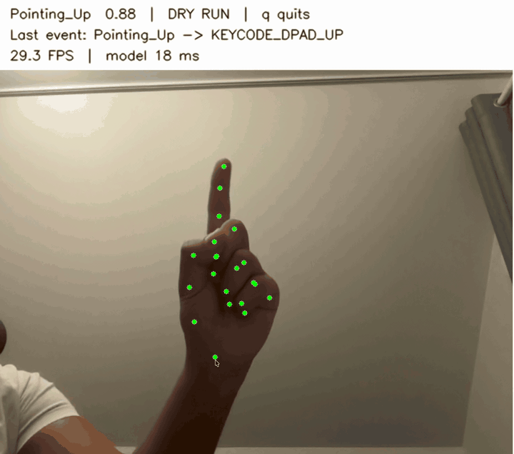

# Headwave TV Control

Control Chromecast with Google TV using static hand gestures. A camera detects the
gesture, Raspberry Pi translates it into a command, and ADB sends the command to
the TV.

## Diagram


## Hardware

- **Raspberry Pi 5** runs gesture recognition and sends TV commands.
- **Camera Module 3** captures the user's hand and connects directly to the Pi.
- **Chromecast with Google TV** receives commands over the local network through
  Wireless debugging.

## Hand gestures

[](docs/media/handGestures.mov)

The built-in MediaPipe model recognizes these gestures. Their TV commands are set
in `config.example.json` and can be changed:

| Gesture label | Hand pose | Example TV command |
|---|---|---|
| `Open_Palm` | Open hand | Play/pause |
| `Closed_Fist` | Closed fist | Select/OK |
| `Thumb_Up` | Thumb up | Volume up |
| `Thumb_Down` | Thumb down | Volume down |
| `Victory` | Two-finger V sign | Back |
| `Pointing_Up` | Index finger pointing up | Navigate up |
| `ILoveYou` | I-love-you hand sign | Home |


The gesture files are:

| File | Purpose |
|---|---|
| `config.example.json` | Example camera settings and gesture-to-command mappings |
| `config.local.json` | Personal settings and final gesture mappings |
| `models/gesture_recognizer.task` | Downloaded MediaPipe model for built-in gestures |
| `data/gestures.jsonl` | Collected landmarks and labels for custom gestures |
| `models/custom.json` | Custom model created by `headwave train` |

The generated model, training data, and local configuration are ignored by Git.

### Camera preview and response time

```bash
headwave run
```

The default filter accepts a stable pose after 0.18 seconds and allows at most one
event every 0.25 seconds.  Holding the same pose does not repeat it; release for 0.15 seconds 
to use that same pose again. 

 `config.local.json`, updatea timing values:

```json
"hold_seconds": 0.18,
"release_seconds": 0.15,
"cooldown_seconds": 0.25,
"switch_without_release": true
```

Set `switch_without_release` to `false` to require release before every new event.
Increase hold/cooldown times if accidental pose changes trigger commands. 
Dry-run mode does not contact the TV.

### 1. Collect samples

Create samples for every gesture and a `none` class for poses that should do
nothing:

```bash
headwave collect --label PlayPause
headwave collect --label VolumeUp
headwave collect --label none
```

Press Space to save a detected hand and `q` to finish. Record each gesture from
different angles, distances, and lighting conditions. At least 20 samples are
required for each label.

#### Hand landmark table

MediaPipe detects 21 points on the hand. Each point contains `x`, `y`, and `z`,
giving **63 coordinate values per sample**. **Point 0 is the wrist.**

| Thumb | Index finger | Middle finger | Ring finger | Little finger |
|---|---|---|---|---|
| **1** · Base | **5** · Knuckle | **9** · Knuckle | **13** · Knuckle | **17** · Knuckle |
| **2** · Knuckle | **6** · Middle joint | **10** · Middle joint | **14** · Middle joint | **18** · Middle joint |
| **3** · Joint | **7** · Joint near tip | **11** · Joint near tip | **15** · Joint near tip | **19** · Joint near tip |
| **4** · Tip | **8** · Tip | **12** · Tip | **16** · Tip | **20** · Tip |

#### Training data example

Each collected sample stores a gesture label and the 21 points in
`data/gestures.jsonl`. During training, `features()` subtracts the wrist position
and divides all coordinates by the largest absolute value. The wrist becomes
`(0, 0, 0)`, reducing the effect of hand position and scale.

The table below shows **illustrative normalized values, not recorded training
results**. Only three of the 21 points are shown to keep it readable.

| Example label | Wrist: point 0 `(x, y, z)` | Thumb tip: point 4 `(x, y, z)` | Index tip: point 8 `(x, y, z)` |
|---|---|---|---|
| `PlayPause` | `(0.00, 0.00, 0.00)` | `(0.35, -0.40, -0.10)` | `(0.25, -1.00, -0.08)` |
| `VolumeUp` | `(0.00, 0.00, 0.00)` | `(0.20, -1.00, -0.05)` | `(0.40, -0.45, -0.20)` |

Headwave saves raw samples as JSONL and normalized examples in `models/custom.json`.
This table is a readable explanation of those values; no CSV file is generated.
The `z` coordinate is estimated by the model, not measured in meters.

### 2. Train the model

```bash
headwave train
```

The program normalizes the collected hand landmarks and stores them as a simple
k-nearest-neighbors model in `models/custom.json`. No photos or videos are saved.

### 3. Assign TV commands

Add the trained labels to `config.local.json`:

```json
{
  "gestures": {
    "PlayPause": "KEYCODE_MEDIA_PLAY_PAUSE",
    "VolumeUp": "KEYCODE_VOLUME_UP"
  }
}
```

### 4. Test the gestures

```bash
headwave run --config config.local.json --custom-model models/custom.json
```

Commands are printed during testing. When the gestures work reliably, start TV
control on the Pi:

```bash
headwave run --config config.local.json \
  --custom-model models/custom.json --live --headless
```
