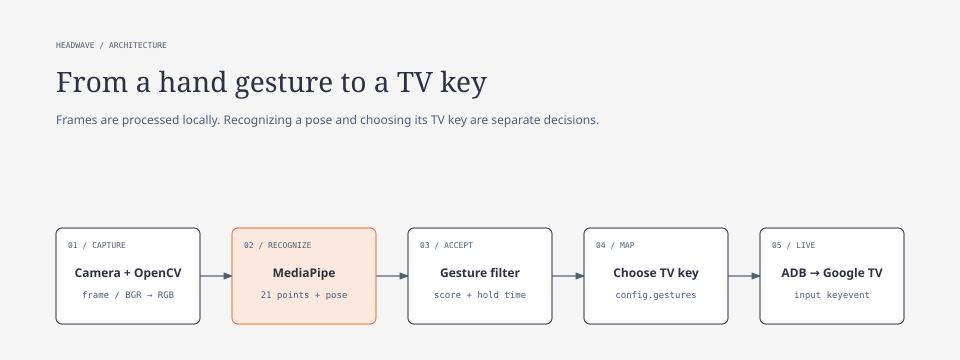
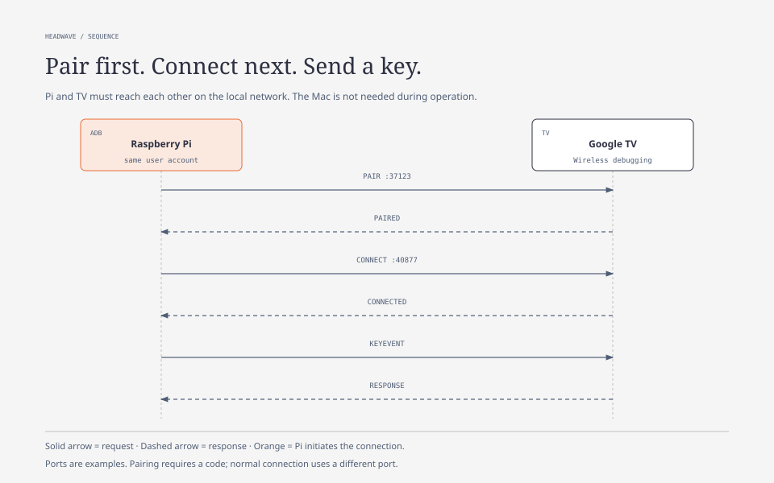
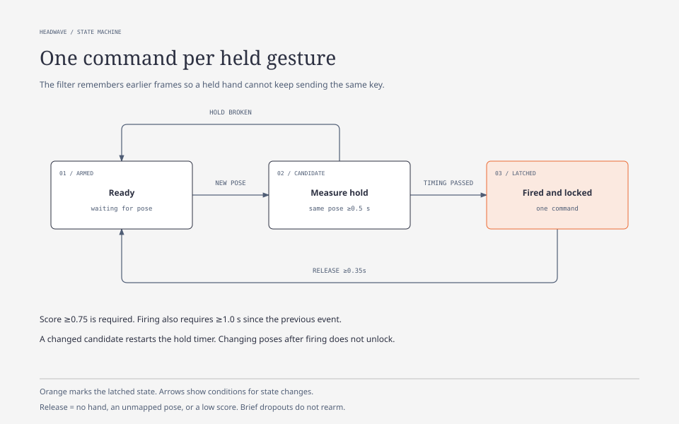
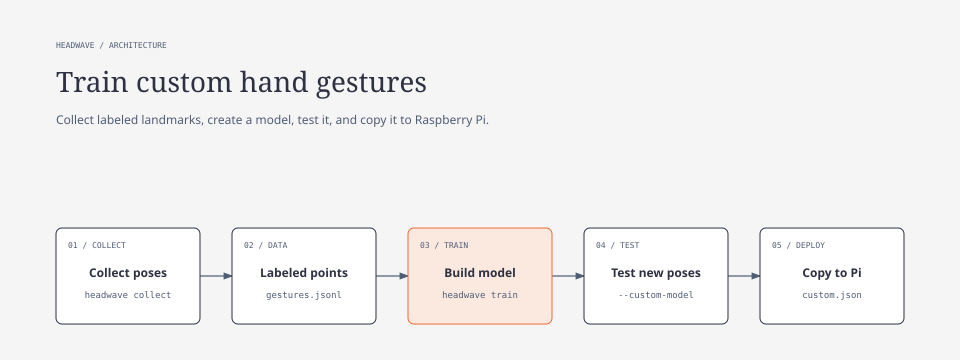
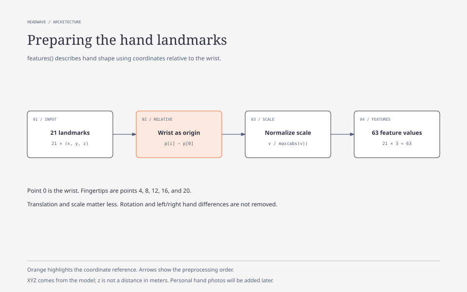

# Headwave TV Control

Control Google TV with hand gestures. Develop and test on **Mac**, run the software
on **Raspberry Pi 5**, and pair the TV directly from the Pi. **Camera Module 3** is
the planned camera for the Pi installation.



## Project status

Implemented: Mac camera preview, built-in gestures, gesture filtering, landmark
collection, a simple custom pose classifier, and ADB commands. Camera Module 3
integration, Pi/TV hardware testing, custom training results, and final gesture
assignments are still pending. The current key mappings are provisional examples.

This version recognizes **static hand poses**, one hand at a time. Swipe detection
and other gestures that depend on movement over time are not implemented yet.

## Directory

```text
Headwave-tv-control/
│  README.md                      # All setup, usage, and training documentation
│  pyproject.toml                 # Dependencies and the headwave command
│  config.example.json            # Camera, timing, and provisional TV mappings
│  LICENSE
│
├─ src/headwave/
│  │  __init__.py
│  │  cli.py                      # run, collect, train, pair, connect
│  │  camera.py                   # Camera frames and MediaPipe processing
│  │  filter.py                   # Hold, release, and cooldown logic
│  │  adb.py                      # TV connection and key events
│  └─ custom.py                   # Landmark normalization and custom poses
│
├─ models/                        # Local files; ignored by Git
│  │  gesture_recognizer.task     # Downloaded from Google
│  └─ custom.json                 # Created after custom training
├─ data/                          # Created during collection; ignored by Git
│  └─ gestures.jsonl              # Labels and 21 XYZ landmarks per sample
├─ tests/
│  └─ test_core.py
├─ deploy/
│  └─ headwave.service.example    # Raspberry Pi startup service template
├─ scripts/
│  └─ build_diagrams.py           # Rebuilds the documentation figures
└─ docs/
   ├─ diagrams/                   # HTML sources, SVG images, third-party license
   └─ media/                      # Your hardware photos and demo images, added later
```

The tree also shows files created later: `custom.json` and training data do not
exist until collection and training have been performed. Models and data do not
travel with a normal Git clone. This project does not contain the reference
repository's `app.py`, notebooks, CSV, HDF5, or standalone TFLite classifiers.

## Develop on Mac

Use Python **3.11** on both machines where possible. With Homebrew installed,
run these commands from the project directory:

```bash
brew install python@3.11
python3.11 -m venv .venv
source .venv/bin/activate
python -m pip install --upgrade pip
python -m pip install -e .
headwave download-model
headwave run
```

Skip the download if the model already exists. Allow camera access for your
terminal/application in macOS Privacy & Security → Camera. Press `q` or Escape
in the camera window to quit, or Ctrl+C in the terminal.

`source .venv/bin/activate` selects the project's Python environment. `headwave run`
starts the camera. By default, intended TV commands are printed in the terminal;
no TV connection is made. ADB is not required for this Mac test mode.

To customize settings:

```bash
cp config.example.json config.local.json
headwave run --config config.local.json
```

`camera: 0` selects the first camera; try `1` if the wrong camera opens. The preview
is mirrored, while recognition and sample collection use the unmirrored image.

The project allows Python 3.9–3.12. MediaPipe is pinned to **0.10.18**, which has
macOS and Linux ARM64 packages. OpenCV is pinned to 4.10.0.84 and NumPy is kept below 2.
Do not install additional OpenCV distributions that also provide `cv2` in this environment.

Installation and model execution were verified locally on Apple M4 with Python 3.9.6.
The Mac wheel's internal metadata names Intel despite containing ARM64 libraries,
so `pip check` reported a platform mismatch in that environment; model execution succeeded.

## Hardware: Raspberry Pi 5 + Camera Module 3

| Component | Role |
|---|---|
| Raspberry Pi 5 | Runs recognition, filtering, and ADB locally. |
| Camera Module 3 | Captures the user's hand. |
| Pi 5 camera cable | Connects the camera's 15-pin socket to the Pi's 22-pin socket. |
| Power supply and cooling | Support continuous image processing. |
| microSD or another system drive | Stores Raspberry Pi OS 64-bit and the software. |
| Ethernet, with Wi-Fi as backup | Connects the Pi to the TV's local network. |
| Google TV device | Receives ADB key events. |

Pi 5 has a quad-core 64-bit Cortex-A76 processor, Gigabit Ethernet, Wi-Fi, and two
MIPI camera/display interfaces. Its specifications include 5 V/5 A USB-C power;
active cooling is available for sustained workloads. Headwave's actual Pi frame
rate has not been measured. [Raspberry Pi 5 specifications](https://www.raspberrypi.com/products/raspberry-pi-5/)

Camera Module 3 uses an approximately 12 MP Sony IMX708 sensor with autofocus.
The standard variant has a 75° diagonal field of view; Wide has 120°. Headwave's
current test configuration requests 640 × 480 rather than full sensor resolution.
[Camera Module 3 specifications](https://www.raspberrypi.com/products/camera-module-3/)

### Connect the camera

Shut down and disconnect Pi power before attaching the ribbon cable. Use the
correct Pi 5 cable and follow the manufacturer's connector-orientation instructions.
The wider standard cable used with older Pi boards does not fit Pi 5 directly.
[Official camera connection guide](https://www.raspberrypi.com/documentation/accessories/camera.html)

> **Photo to add later:** your Pi 5, Camera Module 3, and ribbon cable connection.

### Camera support

| Camera path | Status |
|---|---|
| Mac camera → OpenCV | Implemented; camera test started on Mac. |
| Pi USB camera → OpenCV | Same implementation; Pi hardware verification pending. |
| Camera Module 3 → Picamera2 | Planned adapter; not yet implemented in Headwave. |

Camera Module 3 uses the libcamera/Picamera2 stack. The planned adapter will supply
frames to the same subsequent OpenCV/MediaPipe processing. Changing the JSON camera
index alone does not add Picamera2 support.

Check the camera independently of Headwave first:

```bash
rpicam-hello --list-cameras
rpicam-still --nopreview -o camera-test.jpg
```

If Picamera2 is missing:

```bash
sudo apt install python3-picamera2
```

Picamera2 and libcamera are tied to the system Python. We still need to verify their
Python/NumPy compatibility with Headwave when implementing the adapter. Installing
this package does not automatically expose it inside an isolated `.venv`.
[Official camera software documentation](https://www.raspberrypi.com/documentation/computers/camera_software.html)

### Install the current version on Pi: USB camera

Use Raspberry Pi OS **64-bit**, preferably with Python 3.11. Bookworm includes 3.11.
If your OS uses Python 3.13 or later, prepare a separate compatible environment;
do not replace the system Python.

Copy or clone the code, then install from the project directory on the Pi:

```bash
sudo apt update
sudo apt install -y python3-venv python3-dev adb libgl1 libglib2.0-0 libportaudio2
python3.11 -m venv .venv
source .venv/bin/activate
python -m pip install --upgrade pip
python -m pip install .
headwave download-model
```

Skip the final command if the model was copied from Mac. Copy `models/custom.json`
separately if using custom poses. Create a fresh `.venv` on Pi; Mac binaries cannot
be reused on Linux. The Mac does not need to remain running during Pi operation.

## Connect to Google TV

Pair **from the Pi**, using the same Pi account that will run Headwave. ADB stores
the pairing credentials for that account. Do not copy the Mac's ADB keys.



### 1. Join the local network

The Pi normally uses Ethernet. Configure Wi-Fi as a lower-priority backup through
Pi OS/NetworkManager. Headwave uses IP networking and does not configure or select
network interfaces. Guest networks or client isolation can prevent communication.

Android's guide describes a shared Wi-Fi network. Ethernet on Pi through the same
LAN should work, but the actual TV and network setup still need verification.

### 2. Enable Wireless debugging on TV

Enable developer options and open **Wireless debugging → Pair using pairing code**.
Android documents code-based wireless debugging on TV from Android 13; availability
and menus depend on the manufacturer. Check that the actual TV offers this feature.
[Android ADB guide](https://developer.android.com/tools/adb#connect-to-a-device-over-wi-fi)

> **Screenshot to add later:** the TV's Wireless debugging menu, without an active pairing code.

### 3. Pair, then connect

Replace the example addresses with the values shown on your TV:

```bash
headwave pair 192.168.1.50:37123
# Enter the pairing code when ADB asks.
headwave connect 192.168.1.50:40877
headwave devices
```

**The pairing port and connection port are different.** Read the connection port
from the main Wireless debugging screen, not the pairing dialog. It can change
after a restart.

Copy `config.example.json` to `config.local.json` and set the connection endpoint:

```json
"adb_serial": "192.168.1.50:40877"
```

### 4. Start TV control

Once the camera and test mode work:

```bash
headwave run --config config.local.json --live --headless
```

For custom poses, add `--custom-model models/custom.json`. `--live` enables TV
commands; `--headless` hides the camera window. Stop with Ctrl+C. Media and volume
key behavior can vary between TV applications and audio setups.

### Recovery and automatic startup

A camera or ADB failure stops Headwave. Check the address/port, reconnect, then
restart the application. A timed-out key is not automatically sent again because
it might already have executed. Automatic port discovery and reconnection are not
implemented; Ethernet-to-Wi-Fi failover must also be tested on the real system.

After a successful manual test, edit `deploy/headwave.service.example`: replace
`USER` and paths, use the pairing account, and add an absolute custom-model path if needed.

```bash
sudo cp deploy/headwave.service.example /etc/systemd/system/headwave.service
sudo systemctl daemon-reload
sudo systemctl enable --now headwave
journalctl -u headwave -f
```

The template uses `Restart=no`. After fixing a problem, restart manually with
`sudo systemctl restart headwave`. The account also needs camera access, commonly
through the Pi OS `video` group.

## How the code works

Recognition chooses a **gesture name and score**. Filtering decides **when it counts**.
Configuration chooses **which TV key it means**. Changing a key assignment does
not require retraining the gesture recognizer.

### Files and functions

| File / function | Responsibility |
|---|---|
| `cli.config(path)` | Reads JSON, checks settings, and resolves the model path relative to the config file. |
| `cli.main()` | Parses commands and dispatches camera, collection, training, download, or ADB actions. |
| `camera.run(config, args)` | Opens the camera, analyzes frames, displays results, collects samples, and dispatches accepted events. |
| `GestureFilter.__init__()` | Stores thresholds and initializes timing/latch state. |
| `GestureFilter.update(label, score, now)` | Checks stability, release, and cooldown; returns a gesture name or `None`. |
| `adb.endpoint(value)` | Validates the host:port format; does not check reachability. |
| `adb.command(*args, interactive=False)` | Runs ADB with error handling and a timeout: 5 seconds normally, 120 for pairing. |
| `AdbRemote.__init__(serial)` | Stores one selected TV endpoint. |
| `AdbRemote.connect()` | Connects, then checks that the selected device reports `device`. |
| `AdbRemote.send(key)` | Sends a key event to that TV without automatic retries. |
| `custom.features(points)` | Makes 21 XYZ landmarks wrist-relative and scale-normalized. |
| `custom.train(source, destination)` | Checks labels/sample counts and saves normalized examples. |
| `CustomClassifier.__init__(path, max_distance)` | Loads and validates the custom model. |
| `CustomClassifier.predict(points)` | Compares five nearest examples and rejects unknown poses. |

`__init__.py` marks the Python package. `pyproject.toml` declares dependencies and
connects the `headwave` command to `cli.main()`.

### The camera loop

For every frame, OpenCV reads pixels and converts BGR to RGB. MediaPipe receives
an increasing timestamp and processes the frame in `VIDEO` mode. This mode accepts
camera frames as a timed sequence; it does not require a prerecorded video file.

The default path uses MediaPipe's highest-scoring gesture. Custom mode uses its
hand landmarks with our classifier instead. Unmapped gestures count as inactive.
The accepted event is looked up in `config["gestures"]`, then printed in test mode
or sent through ADB in live mode. ADB calls are synchronous, so frame processing
waits for each call to finish.

The preview is mirrored only after recognition. Space in collection mode appends
landmarks and a label; it does not save the camera image. A `finally` block releases
the camera and closes any preview windows when the loop ends.

### Gesture filtering



| Setting | Default | Meaning |
|---|---:|---|
| `confidence` | 0.75 | Minimum accepted gesture score. |
| `hold_seconds` | 0.5 | How long the same accepted gesture must remain stable. |
| `release_seconds` | 0.35 | How long an accepted mapped gesture must be absent to rearm. |
| `cooldown_seconds` | 1.0 | Minimum interval between events. |
| `camera` | 0 | Camera index. |
| `width`, `height` | 640, 480 | Requested capture dimensions; camera support may differ. |

The filter remembers its current candidate, when it started, when acceptable input
went away, whether an event has latched it, and the last event time. A changed
candidate restarts the hold timer. After firing, switching directly to another
mapped pose does not unlock it: no hand, an unmapped pose, or a low score must be
observed for the release interval. Short tracking dropouts do not rearm it.

There is no separate activation gesture or automatic volume-key repeat yet.
We will decide the final gestures and TV actions together; the mappings currently
in `config.example.json` are provisional test values.

## Training

**We will train later, after choosing the gestures.** The tools are prepared;
your photos, dataset, test sessions, and measured results will be added afterward.



### Hand sign recognition training

#### 1. Learning data collection

Choose the static poses first. A label identifies a pose; it does not automatically
assign a TV action. For an example class called `MyGesture`:

```bash
headwave collect --label MyGesture
headwave collect --label none
```

Show your hand and press **Space** for each sample. Press `q` to finish. A sample is
saved only when MediaPipe detects a hand. `none` contains other hand poses that
should not trigger TV actions.

At least 20 examples per class are required. Collecting 100–200 varied examples is
a starting suggestion, not a precision guarantee. Vary distance, angle, lighting,
and background. Use separate collection sessions and record which hands/people
are represented.

> **Photos to add later:** one clear photo of every selected pose and examples of `none`.

#### 2. What is recorded?

`data/gestures.jsonl` contains one JSON object per line:

| Field | Content |
|---|---|
| `label` | The class name, such as `MyGesture` or `none`. |
| `landmarks` | 21 points with `x`, `y`, and `z`; point 0 is the wrist. |

No photos or videos are stored by collection. Take documentation photos separately.
The `z` value is a model-estimated depth coordinate, not a measurement in meters.

#### 3. Landmark preprocessing



`features()` in `custom.py`:

1. Checks for 21 points with three coordinates each.
2. Subtracts the wrist coordinates from every point.
3. Divides all values by the largest absolute coordinate value.
4. Returns 63 normalized numbers: 21 × 3.

This reduces sensitivity to translation and scale. It does not automatically
normalize rotation or switching between left and right hands. Non-finite values
and degenerate landmarks are rejected.

